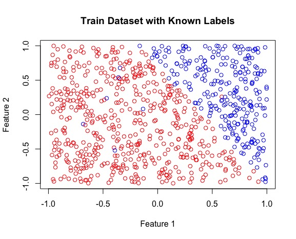

---
header:
  image: /assets/perceptron_neuron.png

author_profile: true

classes: wide

---

## Understanding the linearly separable binary classifier from the ground up using R

The perceptron. It has become a rite of passage for comprehending the underlying mechanism of neural networks, and machine learning as a whole. The algorithm was invented in 1957 at the Cornell Aeronautical Laboratory by Frank Rosenblatt with funding from the US government [[1]](http://psycnet.apa.org/doiLanding?doi=10.1037%2Fh0042519). The concept behind the perceptron is simple: separate two distinct categories of data based on linear separability. This tutorial uses data that has 2 dimensions, which can be downloaded [here](assets/2018-03-04-Single-Layer-Perceptron-Implementation/percep_data.csv). Lets start by importing the data into RStudio, then dividing the dataset into separate train and test DataFrames (80% train, 20% test). 


# imports csv file
percep_data <- read.csv("percep_data.csv", sep = ",")

# divides complete dataset into test and train datasets
indexes <- sample(1:nrow(percep_data), size = 0.8 * nrow(percep_data))
train <- percep_data[indexes,]
test <- percep_data[-indexes,]



Our data is now ready to be classified. But as always, exploratory data analysis (EDA) is an important process that should not be overlooked. We can plot the train set with the known labels so we know what to expect of our implemented perceptron function.



str(train)
with(train, plot(X1, X2, col = Y + 3, xlab = "Feature 1", ylab = "Feature 2", main = "Train Dataset with Known Labels"))



 
