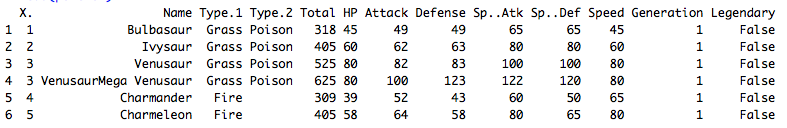
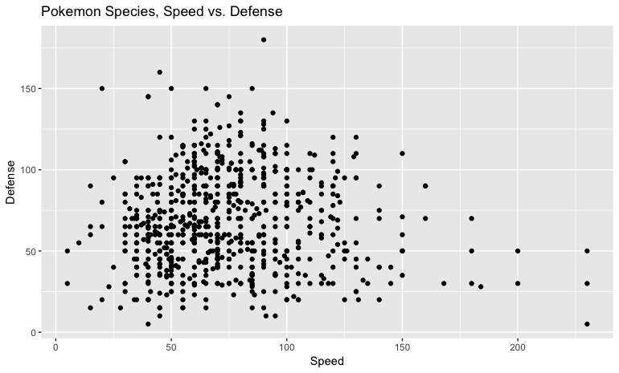
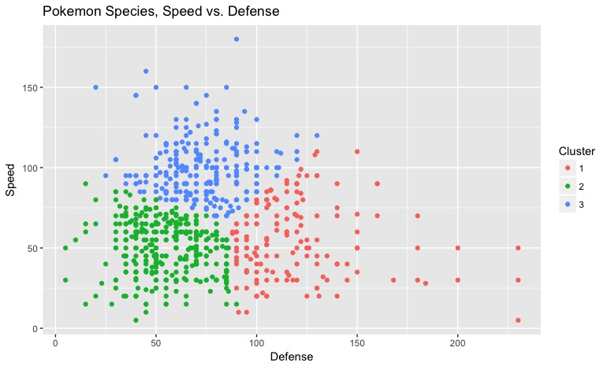
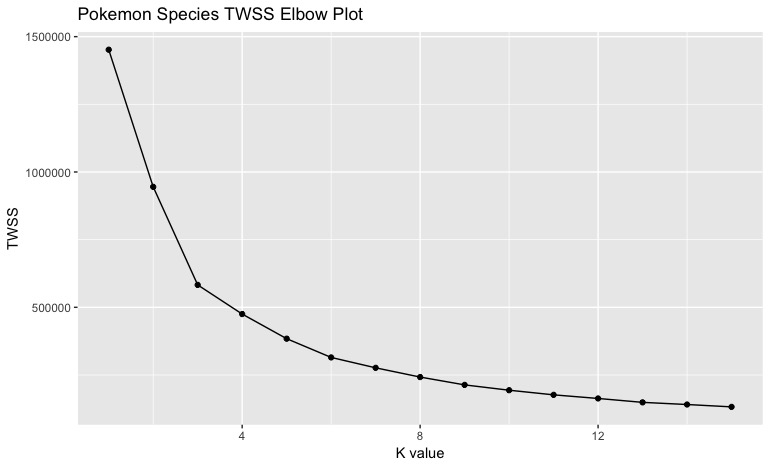
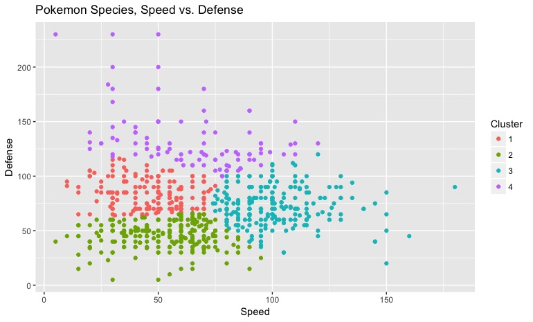

---
header:
  image: /assets/2018-03-16-K-Means-Clustering/pokemon_background.jpg

author_profile: true

classes: wide

---

## Step by step how to build the renowned unsupervised machine learning algorithm from scratch

K-means Clustering is a type of unsupervised (no labeled data necessary) machine learning algorithm that determines optimal grouping, or clustering, amongst a dataset. This method is a great way to find patterns in your data. For instance, let's say you're working with the [Pokemon dataset](https://www.kaggle.com/abcsds/pokemon/data) by Alberto Barradas derived from the original Pokemon games (Gold, Silver, Ruby, Sapphire, etc):



pokemon <- read.csv("pokemon.csv", sep = ",")
head(pokemon)



 

This dataset contains 12 features consisting of the number, name, first and second type, and basic statistics: Total Points, HP, Attack, Defense, Special Attack, Special Defense, Speed, Generation and Legendary status for exactly 800 pokemon (observations) describing the data. It turns out these pokemon statistics serve as a great introduction to unsupervised learning. 

We begin by plotting the relationship between Pokemon Speed and Defense using ggplot: 



ggplot(pokemon, aes(x = Speed, y = Defense)) + geom_point() + 
ggtitle("Pokemon Species, Speed vs. Defense") +
xlab("Speed") + ylab("Defense")



 

How would the K-means Clustering algorithm be applicable to this relationship of two pokemon features? If we are doing an analysis of pokemon to classify, or group, the pokemon that have optimal speed _and_ defense, K-means Clustering can determine the grouping of these pokemon. We will choose an arbitrary k value of 4. Once the K-means Clustering algorithm is rendered to the plot, we obtain the following result: 



k <- 4
pokemon_speed_defense <- pokemon[,c(11,8)]
km.out <- kmeans(pokemon_speed_defense, centers = k, nstart = 20, iter.max = 50)

ggplot(pokemon_speed_defense, aes(x = Speed, y = Defense, color = factor(km.out$cluster))) 
+ geom_point() + labs(color = "Cluster") + ggtitle("Pokemon Species, Speed vs. Defense")



 

It looks like the pokemon in cluster 2 have optimal defense and adequate speed, and the pokemon in cluster 3 have optimal speed and adequate defense. Although we have obtained our answer, I used the built in kmeans() R function to complete this task. But what happens behind the scenes with K-means clustering algorithm? How does it determine cluster assignments? All will be explained. 

## Determining Optimal Number of Clusters

The K-means Clustering function should have two parameters: dataset and desired number of clusters. The user determines the optimal number of clusters to be assigned using an eblow (scree) plot. Due to the random initial clustering assignments, some clustering outcomes may be better than others. But how can we tell which assignments are better than others?

You must be thinking "isn't there a quantitative way to measure the efficacy of K-means Clustering?" The answer is yes. The optimal clustering assignment will have the lowest total within sum of squares (twss) value. This is defined as the sum of the distance of every point to their assigned cluster center (centroid). Thinking about this visually, a dataset with a _low_ twss value will have their datapoints clumped together in obvious clusters, whereas not so obvious clusters will have a _high_ twss value. 

A K-means function with a k value of 1 would only have 1 centroid, so the twss value of this function would be extremely high considering the sum of the distances of each point on the edge of the plot to the centroid would significantly increase the twss value. But if the k value is 2, the sum of the distances of these points to their respective centroids decreases markedly, thus decreasing the twss value. This trend continues as k increases until twss ceases to decrease substantially. The plot of the relationship between the k value and twss is called an elbow plot. 



twss <- 0
for (i in 1:15) {
    km.out <- kmeans(pokemon_speed_defense, centers = i, nstart = 20, iter.max = 50)
    wss[i] <- km.out$tot.withinss
}

elbow <- data.frame(c(1:15), wss)
ggplot(elbow, aes(x = c.1.15., y = wss)) + geom_point() + geom_line() + 
ggtitle("Pokemon Species TWSS Elbow Plot") + xlab("K value") + ylab("TWSS")



 

The interpretation of the elbow plot is up to the discretion of the user. I chose a k value of 4 because that is when the twss value begins to level off, but another data scientist could have chosen a k value of 3 or even 6 depending on the research situation and the question he or she is trying to answer. The takeaway here is to use an elbow plot to determine the appropriate amount of clusters for the K-means Clustering algorithm. 

## K-means Clustering Algorithm Steps 

The steps of the K-means Clustering algorithm is the following: 
1. Randomly create k points for starting cluster centers (centroids)
2. Each point in the dataset is assigned to the cluster of the nearest centroid based on closest euclidean distance
- While any point has changed cluster assignment:
- For every point in our dataset:
- For every centroid:
3. Calculate the distance between the centroid and point
4. Assign the point to the cluster with the lowest distance
5. For every cluster, calculate the mean of the points in that cluster; assign this as the new coordinates of the centroid
6. Repeat until dataset cluster assignments do not change (error = 0)

## Source Code

Lets define a function that calculates euclidean distance, which is the distance formula from high school algebra:



euclid_dist <- function(x, y) {
  
    # initialize distance to 0    
    distance = 0  
    
    # loops by number of columns in x (should be 2)
    for (i in (1:length(x))) {  
    
        # subtract each value from their respective columns; square the difference, then add this value to distance
        distance = distance + (x[[i]] - y[[i]])^2                                                    
    }
    
    # square root of the distance
    distance = sqrt(distance)  
    return (distance)
}



Since the euclidean distance function is defined, we can dive into the actual K-means Clustering function that completes the heavylifting. 



# function that calculates k nearest clusters of a dataset
# km_data = input dataset defined as km_data[1] = x, km_data[2] = y, k = number of clusters
km_function <- function(km_data, k) {
  
    # initializing random cluster datapoints based on points from dataset
    # concatentate the x and y coordinates into data frame 
    cluster_loc <- km_data[sample.int(nrow(km_data),k),]
    
    # initialize data frame to store old cluster coordinates
    cluster_loc_old <- as.data.frame(matrix(0, ncol = ncol(km_data), nrow = k))
    
    # empty data frames to store datapoint cluster ID (0, 1, 2, ...) and datapoint of particular cluster assignment
    cluster_id <- vector("numeric", nrow(km_data))
    clu_assign <- as.data.frame(matrix(0, ncol = 2, nrow = nrow(km_data)))
    wss <- vector("numeric")
    
    # error: the distance between previous cluster and new calculated cluster locations 
    # algorithm reaches convergence when clusters no longer change (error = 0)
    error <- sum(euclid_dist(cluster_loc, cluster_loc_old))



The first line of code inside the function randomly determines the initial starting point for the k clusters. The sample.int() function takes k random data values and assigns them as the initial clusters in cluster_loc. 



    # while loop will continue until error is not greater than 0 
    while (error > 0) {
      
        # empty vector to store distances between datapoints and clusters 
        euc_dist = vector("numeric", nrow(cluster_loc))
        
        # for loop assigns each dataset value to its closest cluster 
        for (i in 1:nrow(km_data)) {
            
            # distances between each datapoint and the k clusters
            euc_dist <- euclid_dist(km_data[i,], cluster_loc[1:k,])  
            
            # selects the index of the minimum distance; index serves as cluster ID
            cluster_id[i] <- which.min(euc_dist)                     
        }
        
        # assigns old cluster locations before modifying based on data point coordinate means
        cluster_loc_old <- cluster_loc
        
        # for loop iterates through cluster assignments 
        for (i in 1:k) {
                
            # resets points data frame with 0's after every iteration
            clu_assign = as.data.frame(matrix(0, ncol = ncol(km_data), nrow = nrow(km_data))) 
            
            # for loop iterates through each row in the dataset 
            for (j in 1:nrow(km_data)) {
                
                # checks if the cluster assignment matches the for loop iterator
                if (cluster_id[j] == i) {     
                  
                    # assigns the datapoint of the particular cluster assignment to data frame 'cluster_assign'
                    clu_assign[j,] <- km_data[j,]  
                }
            }
            
            # replaces 0's in dataframe with NA
            clu_assign[clu_assign == 0] <- NA  
            
            # omits NA values from dataframe
            clu_assign <- na.omit(clu_assign)      
            
            # calculates the mean of all x coordinates for the kth cluster 
            cluster_loc[i,1] <- mean(clu_assign[,1])  
            
            # calculcates the mean of all y coordinates for the kth cluster
            cluster_loc[i,2] <- mean(clu_assign[,2])  
            
            # replaces 0's in dataframe with NA
            cluster_loc[cluster_loc == 0] <- NA  
            
            # omits NA values from dataframe
            # this new location data stored in cluster_loc serves as the new location for the k cluster 
            cluster_loc <- na.omit(cluster_loc)      
            
        #  recalcuates the error from new cluster location and old cluster location 
        #  after sufficient while loop iterations, error = 0
        error <- sum(euclid_dist(cluster_loc, cluster_loc_old))
        }
    }
    
    # dataframe to store within sum of squares for each cluster 
    wss = as.data.frame(matrix(0, ncol = 1, nrow = nrow(cluster_loc)))
    
    # loop based on number of clusters 
    for (i in 1:k) {
      
        # temporary dataframe to store distances of individual datapoints to final cluster coordinates
        # within sum of squares (wss): Total distance of data points from their respective cluster centroids 
        wss_intv = as.data.frame(matrix(0, ncol = 1, nrow = nrow(km_data)))
        
        # loop through all data in the dataset
        for (j in 1:nrow(km_data)) {
          
            # verifies datapoint correspondings to cluster in question
            if (cluster_id[j] == i)  
                
                # calculcates euclidean distance between datapoint and cluster
                wss_intv[j,] <-  euclid_dist(km_data[j,], cluster_loc[k,]) 
        }
    
    # replaces 0's in dataframe with NA
    wss_intv[wss_intv == 0] <- NA    
    
    # omits NA in dataframe
    wss_intv <- na.omit(wss_intv)       
    
    # sums all distances to calculate within sum of squares
    wss[k,] <- sum(wss_intv)           
    }
     
    # sums all within sum of squares to calculate total within sum of squares
    totalss <- sum(wss) 
    
    return(list(twss = totalss, cluster_id = cluster_id))
}

implemented_kmeans <- km_function(pokemon_speed_defense, 4)
ggplot(pokemon_speed_defense, aes(x = Speed, y = Defense, color = factor(implemented_kmeans$cluster_id))) 
+ geom_point() + labs(color = "Cluster") + ggtitle("Pokemon Species, Speed vs. Defense")



 

This plot is exactly the same as the plot with the built in K-means Clustering function. 

If you want to take a look at the source code, please see this [github repository](https://github.com/sokolj1/K_Means_Clustering) titled K_Means_Clustering. Thank you for reading!

John
