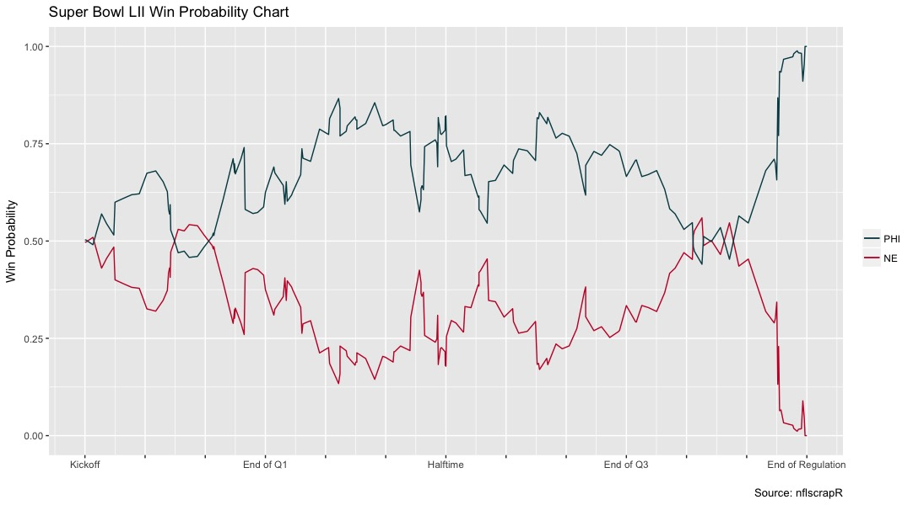

---
header:
  image: /assets/foles.jpg

author_profile: true

classes: wide

---

## Dashboard visualization of Super Bowl XLIV - LII showing win probabilities and play descriptions

As a lifelong Giants fan, it was painful to watch the Philadelphia Eagles win their first championship 
since 1960, and their first Super Bowl victory in the history of the franchise, on February 4th, 2018. Gone are the days
of using the default end all argument with the hypothetical question “How many Super Bowl rings do the Eagles have?” 
The idea is anathema to any Giants fan and any football fan that has a disdain for the birdgang (Cowboys, Redskins, Patriots, etc). 

But as someone who has a love for the game of Football, Super Bowl LII was an incredibly entertaining matchup that established several football precedents, such as: 
>- 1,151 total offensive yardage (Patriots 613 and Eagles 513), more than 200 yards more than any previous Super Bowl.
- The Eagles are the first team in NFL history (regular season or postseason) to win a game despite allowing more than 600 yards.
- The Eagles are the 4th team in NFL history to win the Super Bowl after having a losing record the year before.

Source: [Sportingnews](http://www.sportingnews.com/nfl/news/super-bowl-52-eagles-patriots-stats-fast-facts-records-milestones/1kbmcltvjrukzzty6cpb8796y)

After reading these facts, I decided to dive deeper into the details of this Super Bowl. I wanted to see the pivotal turning points of the game, and how these plays affected both teams chances of winning at any given moment. So I created an interactive Tableau dashboard deliverable for my Data Visualization semester long project. 

Win Probability is a statistical tool that suggests a certain team's likelihood of winning at any given point in the game. For this project, any given point is defined as after each play, so it will be a measure of _post-snap_ win probability.

## Data Source
Determining the right data source wasn't easy, considering data science/statistics for Football does not have the luxury of a built-up analytics infastructure like Baseball as of 2018. I looked into proprietary software like [SportRadar](https://www.sportradar.com/) but I determined paying for a few months of API access was not worth the money. Surreptitiously, while researching data sources, I found the open-source R package [nflscrapR](https://github.com/maksimhorowitz/nflscrapR), which scrapes data off the official NFL API. R is a free programming and statistical software language widely used amongst statisticans and data scientists for data manipulation. Although I was looking to work with Python due to instructor preference, I was already fluent in R from implementing machine learning techniques and a Data Exploration course from Fall 2017, so I knew the learning curve would be minimal to take advantage of nflscrapR. 

### nflscrapR
The nflscrapR Github page provides several examples of querying the official NFL API to help new users hit the ground running. Two important aspects of the package are the following:
- Game level analysis.
- Data available after the 2009 season.

Discovering the data reaches back to 2009 made me reassess the scope of my project: why not visualize team data from _every_ Super Bowl between 2009 and present day? One game didn't seem like enough work for a semester long project. Besides, this meant Super Bowl XLVI (46) would be included, when the Giants upset the Patriots a second time for their 4th franchise Super Bowl. So this sounded like a great idea!

### Data Cleaning & Preprocessing
This step is extremely important in the project workflow. Knowledgeable manipulation skills can save hours of work, which can be devoted to data interpretation and implementing good data visualization practices, all while preserving the integrity of the data itself. To start using R, there are several integrated development environments (IDE) out there, but I recommend using [RStudio](https://www.rstudio.com) because it's user friendly. 

Once RStudio is ready, download the nflscrapR package directly from Github using a few keystrokes:

# need 'devtools' to download packages from Github
install.packages('devtools')
devtools::install_github(repo = "maksimhorowitz/nflscrapR")

# load the package
library(nflscrapR)


The following is R code for retrieving the win probability statistics for Super Bowl LII, and a quick ggplot graphic for exploratory data analysis (EDA). The complete R script is available [here](https://github.com/sokolj1/Super-Bowl-Data-Visualization/blob/master/data_visualization_nflscrapR.R).


# import additional libraries for data viz and manipulation
library(ggplot2)
library(dplyr)

# extract the statistics for the last game of the 2017 season (Super Bowl LII)
super_bowl52 <- game_play_by_play(GameID = tail(extracting_gameids(2017, 
playoffs = TRUE), n = 1))

# queries time remaining after each play, home team win probability, away team win probability, and play description 
eagles_pats <- data.frame(super_bowl52$TimeSecs,super_bowl52$Home_WP_post,
super_bowl52$Away_WP_post, super_bowl52$desc)

# omit erroneous instances where home team win probability == away team win probability
eagles_pats_final <- na.omit(eagles_pats[!(eagles_pats$super_bowl52.Home_WP_post == eagles_pats$super_bowl52.Away_WP_post),])

# rename columns
colnames(eagles_pats_final) = c("time_remaining", "Home", 
"Away", "Play Description")

# ggplot of Super Bowl LII for EDA
ggplot(eagles_pats_final, aes(x = eagles_pats_final$time_remaining, 
y = eagles_pats_final$Home)) + geom_line(aes(x = eagles_pats_final$time_remaining, 
y = eagles_pats_final$Home,color = "#c60c30")) + 
geom_line(aes(x = eagles_pats_final$time_remaining, 
y = eagles_pats_final$Away, color = "#004953")) + 
scale_x_reverse(breaks = c(3600, 3300, 3000, 2700, 2400, 2100, 
1800, 1500, 1200, 900, 600, 300, 0), labels = c("Kickoff", "", "","Q1","","", 
"Halftime", "","","Q3","","","End of Regulation")) + ylab("Win Probability") 
+ xlab("") + ggtitle("Super Bowl LII Win Probability Chart") + 
scale_color_manual(values=c("#004953", "#c60c30"), labels = c("PHI", "NE")) + 
labs(color = "", caption = "Source: nflscrapR") 


 

A few noticeable observations is that the Eagles commanded the greater win probability for a majority of the game, suggesting the Eagles were in the drivers seat with the exception of a few minutes in the first quarter and the final minutes of the game. Although this is a great visualization tool, the graphic doesn't provide context for the data itself, such as what play occurred that resulted in a change in win probability? This involved another layer of data complexity, preferably with plot interactivity. Unfortunately, ggplot does not support this functionality, so I looked elsewhere for an interactive data visualization solution. 

## Choosing the Right Data Visualization Tool

### Tableau

<iframe src = "https://public.tableau.com/views/SuperBowlWinProbabilities/SuperBowl46-52?:showVizHome=no&:embed=true" width="1100" height="805"></iframe>

